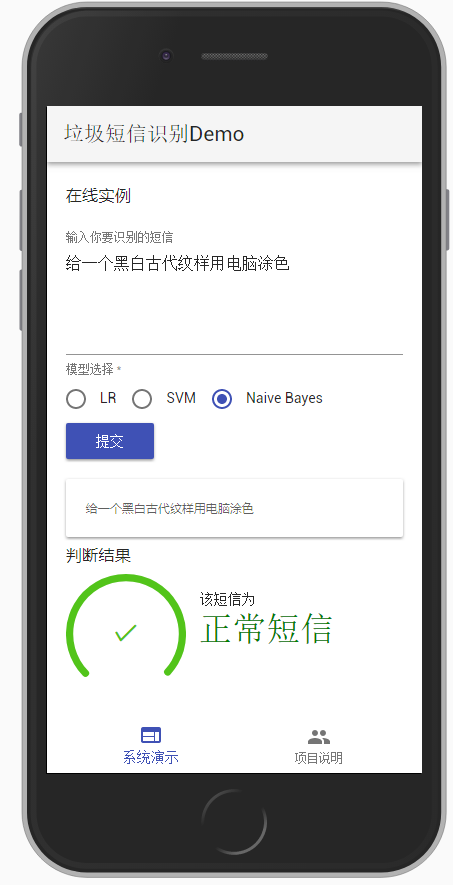
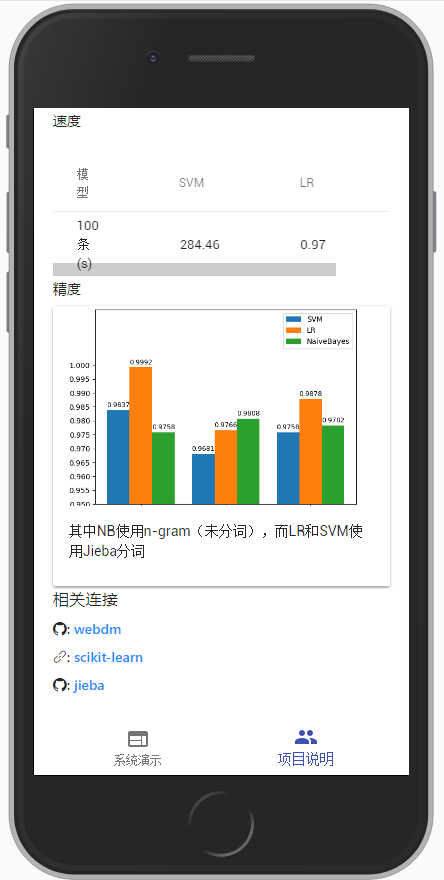

## 网络数据挖掘小组作业


## Project Instruction

项目包括4个部分：3个模型和website在线系统

### Installation

python3.5、node8.0、virtualenv

#### Backend

```
git clone https://github.com/h12345jack/webdm
cd webdm
virtualenv venv
venv\Script\activate
pip installl -r requirements.txt
```

#### Frontend

```
cd website/
npm install
```

### Development

#### Backend

```
python web_server.py
```

#### Frontend

```
cd website/
npm run start
```
http://127.0.0.1:3000

### Build

#### Backend

```
python tornado_server.py
```
Open [http://127.0.0.1:5000](http://127.0.0.1:5000)


### Demo



